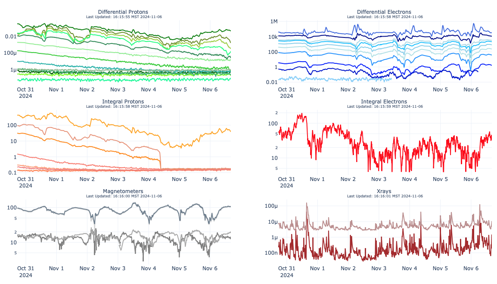
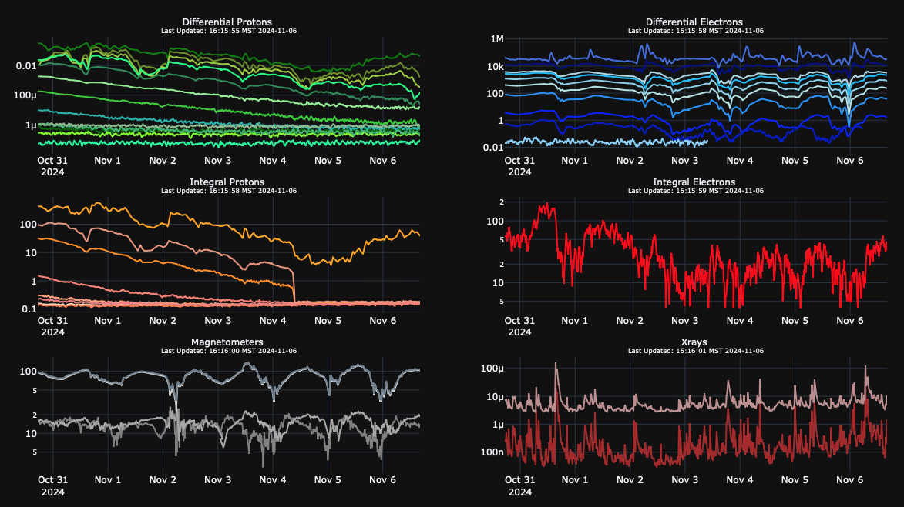

The application is divided up into two top-level scripts, one for data and the other for view, meant to be run
independently. The data agent will download a local copy of the four different time spans of the different data sources
from this base URL:

**https://services.swpc.noaa.gov/json/**

All configuration is handled through the config.ini file with different groups for the data and view agents.
Configuration allows for all supported Plotly template color themes to be used.

Plotly White

Plotly Dark

Data
===
GOES Satellites
---
 * Differential Protons
 * Differential Electrons
 * Integral Protons
 * Integral Electrons
 * Magnetometer
 * Xrays

Data Spans
---
 * 6 hour
 * 1 day
 * 3 day
 * 7 day

Required Packages
===
The Data Agent requires the following packages to be installed:
 * os
 * filehandling
 * configparser

The View Agent requires the following packages to be installed:
 * support
 * configparser
 * plotly
 * json
 * dash

The support packages require the following packages to be installed:
 * json
 * urllib
 * pathlib
