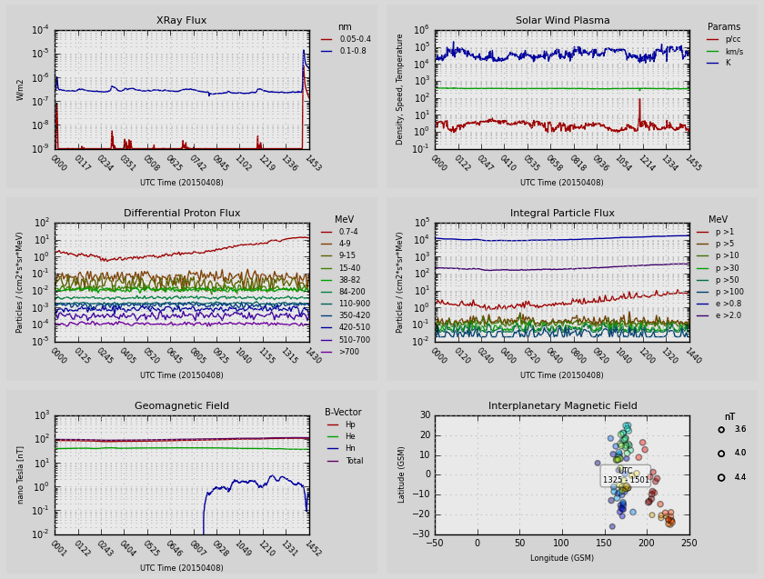
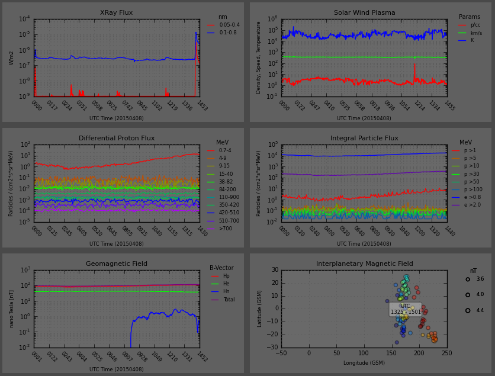

Outages
===
Possible outages between 1500 and 2100 UTC on April 8-9 2015.

**http://www.swpc.noaa.gov/news/swpc-backup-system-testing-continues-wednesday-thursday-april-8-9**

---

This Python application pulls data from the NOAA Satellite near real-time server files located here:

**http://services.swpc.noaa.gov/text/**

The application parses the data from the NOAA servers and initializes a timer for each plot,

which is embedded within a Qt Widget and thus updated individually.

Light Mode

Dark Mode

Data
===
GOES Satellites
---
 * Differential Proton Flux
 * Geomagnetic Components and Total Field
 * Discrete Energetic Particle Flux
 * Solar Particle and Electron Flux
 * xRay Flux

ACE Satellites
---
 * Differential Electron / Proton Flux
 * Solar Isotope Spectrometer
 * Interplanetary Magnetic Field
 * Solar Wind Plasma

Required Packages
===
The required packages to be installed to run this application are:
 * matplotlib
 * pyside or pyqt4
 * numpy

Most of the data sets are updated by the NOAA Satellites once every 60 seconds though there
are a few data sets that only update once every 5 minutes.
